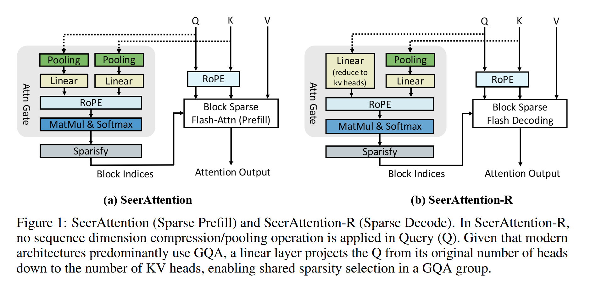

# SeerAttention: Learning Intrinsic Sparse Attention in Your LLMs

[](LICENSE)




Official implementation of [SeerAttention](https://arxiv.org/abs/2410.13276) and [SeerAttention-R](https://arxiv.org/abs/2506.08889) - a novel trainable sparse attention mechanism that learns intrinsic sparsity patterns directly from LLMs through self-distillation at post-training time. Achieves faster inference while maintaining accuracy for long-context prefill and decoding (long-reasoning).

## Key Features
**Trainable Sparse Attention** - Outperform static/predefined attention sparsity    
**Block-level Sparsity** - Hardware efficient sparsity at block level  
**Self-Distillation** - Lightweight training of attention gates (original weights frozen)  
**Efficient Kernel** -  Block-sparse FlashAttention implementation  
**Easy Integration** - Works with existing transformer architectures


## News
- **2025/6/10**: Release SeerAttention-R: training and inference code of decoding sparsity for long-reasoning models. See `eval/reasoning_tasks` for reasoning tasks evaluation.
- **2025/2/23**: Support Qwen. Change the distillation into model adapter so that only AttnGates are saved.
- **2025/2/18**: Deepseek's Native Sparse Attention ([NSA](https://arxiv.org/abs/2502.11089)) and Kimi's Mixture of Block Attention ([MoBA](https://github.com/MoonshotAI/MoBA)) all aquire similar trainable sparse attention concepts as us for pretrain models. Great works!
- **2025/10/8** Init of SeerAttention Repo. 


## Hugging Face Models
The current codebase is improved by only saving the distilled AttnGates' weights. During inference, you can composed the AttnGates and original base model. 

### SeerAttention-R: AttnGate for Sparse Decoding

| Base Model                          | HF Link                                                                 | AttnGates Size |
|-------------------------------------|-------------------------------------------------------------------------|----------------|
| Qwen3-4B                            | [SeerAttention-Decode-Qwen3-4B-AttnGates](https://huggingface.co/SeerAttention/SeerAttention-Decode-Qwen3-4B-AttnGates)        | 66.1 MB      |
| Qwen3-8B                            | [SeerAttention-Decode-Qwen3-8B-AttnGates](https://huggingface.co/SeerAttention/SeerAttention-Decode-Qwen3-8B-AttnGates)        | 66.1 MB      |
| Qwen3-14B                           | [SeerAttention-Decode-Qwen3-14B-AttnGates](https://huggingface.co/SeerAttention/SeerAttention-Decode-Qwen3-14B-AttnGates)       | 83.9 MB      |
| DeepSeek-R1-Distill-Qwen-14B        | [SeerAttention-Decode-R1-Distill-Qwen-14B-AttnGates](https://huggingface.co/SeerAttention/SeerAttention-Decode-R1-Distill-Qwen-14B-AttnGates)          | 101 MB       |


### AttnGate for Sparse Prefill

| Base Model                          | HF Link                                                                 | AttnGates Size |
|-------------------------------------|-------------------------------------------------------------------------|----------------|
| Llama-3.1-8B-Instruct               | [SeerAttention-Llama-3.1-8B-AttnGates](https://huggingface.co/SeerAttention/SeerAttention-Llama-3.1-8B-AttnGates)    | 101 MB       |
| Llama-3.1-70B-Instruct              | [SeerAttention-Llama-3.1-70B-AttnGates](https://huggingface.co/SeerAttention/SeerAttention-Llama-3.1-70B-AttnGates)   | 503 MB       |
| Qwen2.5-7B-Instruct                 | [SeerAttention-Qwen2.5-7B-AttnGates](https://huggingface.co/SeerAttention/SeerAttention-Qwen2.5-7B-AttnGates)         | 77 MB        |
| Qwen2.5-14B-Instruct                | [SeerAttention-Qwen2.5-14B-AttnGates](https://huggingface.co/SeerAttention/SeerAttention-Qwen2.5-14B-AttnGates)        | 189 MB       |
| Qwen2.5-32B-Instruct                | [SeerAttention-Qwen2.5-32B-AttnGates](https://huggingface.co/SeerAttention/SeerAttention-Qwen2.5-32B-AttnGates)        | 252 MB       |
| DeepSeek-R1-Distill-Qwen-14B        | [SeerAttention-DeepSeek-R1-Distill-Qwen-14B-AttnGates](https://huggingface.co/SeerAttention/SeerAttention-DeepSeek-R1-Distill-Qwen-14B-AttnGates) | 189 MB       |
| DeepSeek-R1-Distill-Qwen-32B        | [SeerAttention-DeepSeek-R1-Distill-Qwen-32B-AttnGates](https://huggingface.co/SeerAttention/SeerAttention-DeepSeek-R1-Distill-Qwen-32B-AttnGates) | 252 MB       |
| DeepSeek-R1-Distill-Qwen-14B        | [SeerAttention-DeepSeek-R1-Distill-Qwen-14B-Decode-AttnGates](https://huggingface.co/SeerAttention/SeerAttention-DeepSeek-R1-Distill-Qwen-14B-Decode-AttnGates) | 101 MB       |


## Quick Start

### 1. Environment
```bash
conda create -yn seer python=3.11
conda activate seer
pip install torch==2.4.0
pip install -r requirements.txt
pip install flash-attn --no-build-isolation
pip install -e . 
```


### 2. Inference with AttnGate Adapter
During inference, we automatically compose your original base model with our distilled AttnGates.

SeerAttention supports two sparse methods (Threshold / TopK) to convert a soft gating score to hard binary attention mask. Currently we simply use a single sparse configuration for all the attention heads. You are encourage to explore other configurations to tradeoff the speedup vs quality.
```python
from transformers import AutoTokenizer, AutoConfig
from seer_attn import SeerAttnLlamaForCausalLM ## Sparse Prefill Modeling
from seer_attn import SeerDecodingQwen3ForCausalLM ##  Sparse Decoding Modeling
import torch

## SeerAttention-R: sparse decoding 
model_name = "SeerAttention/SeerAttention-Decode-Qwen3-4B-AttnGates"
config = AutoConfig.from_pretrained(model_name)
tokenizer = AutoTokenizer.from_pretrained(
    config.base_model, 
    padding_side="left",
)
## Token budget based sparsity selection. You can also use threshold method
model = SeerDecodingQwen3ForCausalLM.from_pretrained(
    model_name,
    torch_dtype=torch.bfloat16,
    seerattn_sparsity_method='token_budget', 
    seerattn_token_budget = 4096, 
).cuda()


## SeerAttention: sparse prefill 
model_name = "SeerAttention/SeerAttention-Llama-3.1-8B-AttnGates"
config = AutoConfig.from_pretrained(model_name)
tokenizer = AutoTokenizer.from_pretrained(
    config.base_model, 
    padding_side="left",
)
## Threshold based sparsity selection. You can also use Top-k method
model = SeerAttnLlamaForCausalLM.from_pretrained(
    model_name,
    torch_dtype=torch.bfloat16,
    seerattn_sparsity_method='threshold', # Using a threshold based sparse method, 
    seerattn_threshold = 5e-4, # Higher = sparser, typical range 5e-4 ~ 5e-3
).cuda()


# Ready to inference
```

### 3. Training your AttnGates
In the current self-distillation training setup, you can train the AttnGates for your own model. Here we give an example script for Llama-3.1-8B-Instruct. After the distillation process, the AttnGates' weights will be saved.

```bash
## Run the script to train SeerAttention-R Qwen3-4B decoding gate
## Replace BASE_MODEL to the pretrain model you want to train. 
## Currently only support Qwen2 and Qwen3 architecture. 
## You might need to change the default to chat_template to keep the tokens between <think> </think>. See `chat_template` for examples. 
BASE_MODEL=Qwen/Qwen3-4B bash run_distillation_decode.sh


## Run the script to train llama-3.1-8b prefill gate
BASE_MODEL=meta-llama/Llama-3.1-8B-Instruct bash run_distillation_prefill.sh

```

## Citation

If you find SeerAttention useful or want to use in your projects, please kindly cite our paper:

```bibtex
@article{gao2024seerattention,
    title={SeerAttention: Learning Intrinsic Sparse Attention in Your LLMs},
    author={Gao, Yizhao and Zeng, Zhichen and Du, Dayou and Cao, Shijie and So, Hayden Kwok-Hay and Cao, Ting and Yang, Fan and Yang, Mao},
    journal={arXiv preprint arXiv:2410.13276},
    year={2024}
}

@article{gao2025seerattentionr,
    title={SeerAttention-R: Sparse Attention Adaptation for Long Reasoning},
    author={Gao, Yizhao and Guo, Shuming and Cao, Shijie and and Xia, Yuqing, and Wang, Lei, and Ma, Lingxiao, and Sun, Yutao, and Ye, Tianzhu, and Dong, Li, and So, Hayden Kwok-Hay and Hua, Yu, and Cao, Ting and Yang, Fan and Yang, Mao},
    journal={arXiv preprint arXiv:2506.08889},
    year={2025}
}

```


## Contributing

This project welcomes contributions and suggestions.  Most contributions require you to agree to a
Contributor License Agreement (CLA) declaring that you have the right to, and actually do, grant us
the rights to use your contribution. For details, visit https://cla.opensource.microsoft.com.

When you submit a pull request, a CLA bot will automatically determine whether you need to provide
a CLA and decorate the PR appropriately (e.g., status check, comment). Simply follow the instructions
provided by the bot. You will only need to do this once across all repos using our CLA.

This project has adopted the [Microsoft Open Source Code of Conduct](https://opensource.microsoft.com/codeofconduct/).
For more information see the [Code of Conduct FAQ](https://opensource.microsoft.com/codeofconduct/faq/) or
contact [opencode@microsoft.com](mailto:opencode@microsoft.com) with any additional questions or comments.

## Trademarks

This project may contain trademarks or logos for projects, products, or services. Authorized use of Microsoft 
trademarks or logos is subject to and must follow 
[Microsoft's Trademark & Brand Guidelines](https://www.microsoft.com/en-us/legal/intellectualproperty/trademarks/usage/general).
Use of Microsoft trademarks or logos in modified versions of this project must not cause confusion or imply Microsoft sponsorship.
Any use of third-party trademarks or logos are subject to those third-party's policies.
