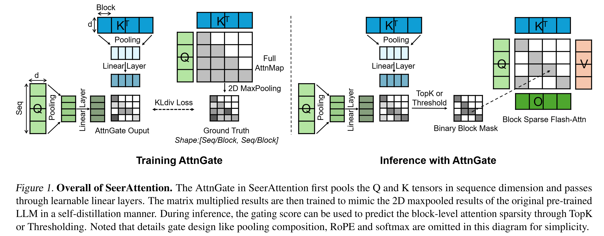

# SeerAttention: Learning Intrinsic Sparse Attention in Your LLMs

[](https://arxiv.org/abs/2410.13276)
[](LICENSE)




Official implementation of **SeerAttention** - a novel sparse attention mechanism that learns intrinsic sparsity patterns directly from LLMs through self-distillation. Achieves faster inference while maintaining accuracy for long-context processing.


## Key Features
**Block-level Sparsity** - Learns dynamic sparsity patterns at block level  
**Self-Distillation** - Lightweight training of attention gates (original weights frozen)  
**Efficient Kernel** - Custom block-sparse FlashAttention implementation  
**Better Accuracy** - Outperforms static/heuristic sparse attention methods  
**Easy Integration** - Works with existing transformer architectures


## HF models

The trained AttnGate with base model [meta-llama/Llama-3.1-8B-Instruct](https://huggingface.co/meta-llama/Llama-3.1-8B-Instruct) is avaliable on Hugging Face! 
| Model | HF Link |
|-------|---------|
| SeerAttention-Llama-3.1-8B | [SeerAttention/SeerAttention-Llama-3.1-8B](https://huggingface.co/SeerAttention/SeerAttention-Llama-3.1-8B) |

## Quick Start

### 1. Environment
```bash
conda create -yn seer python=3.11
conda activate seer
pip install torch==2.4.0
pip install -r requirements.txt
pip install -e . 
```


### 2. Download the pretrained models
```bash
mkdir models
huggingface-cli download meta-llama/Llama-3.1-8B-Instruct --local-dir  models/meta-llama/Llama-3.1-8B-Instruct
```

### 3. Traing Attention Gates with Self-distillation
Only AttnGates are trained to mimic the block-level attention score. In other words, the original model's weights are fronzen. 

```bash
bash run_distillation.sh
```

The core idea of self-distillation training is to use the 2d-maxpooled attention map from original model to train an AttnGate. We provide an efficient kernel to directly output this ground truth. 


```python
### simple pseudo codo for self-distillation AttnGate training
from seer_attn.attn_pooling_kernel import attn_with_pooling

predict_mask = attn_gate(...)

attn_output, mask_ground_truth = attn_with_pooling(
    query_states,
    key_states,
    value_states,
    is_causal, 
    sm_scale,
    block_size      
)

###...
loss = self.loss_func(predict_mask, mask_ground_truth)   
```


### 4. Inference with Sparse Attention
SeerAttention supports two sparse methods (Threshold / TopK)to convert a soft gating score to hard binary attention mask. Currently we simply use a single sparse configuration for all the attention heads. 
```python
from seer_attn import SeerAttnLlamaForCausalLM

# Using a threshold based sparse method
model = SeerAttnLlamaForCausalLM.from_pretrained(
    '/path/to/your/model/',
    torch_dtype=torch.bfloat16,
    seerattn_sparsity_method='threshold', 
    seerattn_threshold = 5e-4, # Higher = sparser, typical range 5e-4 ~ 2e-3
)


# Or using a TopK based sparse method
model = SeerAttnLlamaForCausalLM.from_pretrained(
    '/path/to/your/model/',
    torch_dtype=torch.bfloat16,
    seerattn_sparsity_method='nz_ratio', 
    seerattn_nz_ratio = 0.5, # Lower = sparser, typical range 0.1 ~ 0.9
)

model = model.cuda()

# Ready to inference
```

## Evaluation
For efficiency, we evaluate `block_sparse_attn` compared with full attention by FlashAttention-2. For model accuracy, we evaluate SeerAttention on PG19, Ruler and LongBench. Please refer to `eval` folder for details. 

## Citation

If you find SeerAttention useful or want to use in your projects, please kindly cite our paper:

```bibtex
@article{gao2024seerattention,
    title={SeerAttention: Learning Intrinsic Sparse Attention in Your LLMs},
    author={Gao, Yizhao and Zeng, Zhichen and Du, Dayou and Cao, Shijie and So, Hayden Kwok-Hay and Cao, Ting and Yang, Fan and Yang, Mao},
    journal={arXiv preprint arXiv:2410.13276},
    year={2024}
}

```


## Contributing

This project welcomes contributions and suggestions.  Most contributions require you to agree to a
Contributor License Agreement (CLA) declaring that you have the right to, and actually do, grant us
the rights to use your contribution. For details, visit https://cla.opensource.microsoft.com.

When you submit a pull request, a CLA bot will automatically determine whether you need to provide
a CLA and decorate the PR appropriately (e.g., status check, comment). Simply follow the instructions
provided by the bot. You will only need to do this once across all repos using our CLA.

This project has adopted the [Microsoft Open Source Code of Conduct](https://opensource.microsoft.com/codeofconduct/).
For more information see the [Code of Conduct FAQ](https://opensource.microsoft.com/codeofconduct/faq/) or
contact [opencode@microsoft.com](mailto:opencode@microsoft.com) with any additional questions or comments.

## Trademarks

This project may contain trademarks or logos for projects, products, or services. Authorized use of Microsoft 
trademarks or logos is subject to and must follow 
[Microsoft's Trademark & Brand Guidelines](https://www.microsoft.com/en-us/legal/intellectualproperty/trademarks/usage/general).
Use of Microsoft trademarks or logos in modified versions of this project must not cause confusion or imply Microsoft sponsorship.
Any use of third-party trademarks or logos are subject to those third-party's policies.
